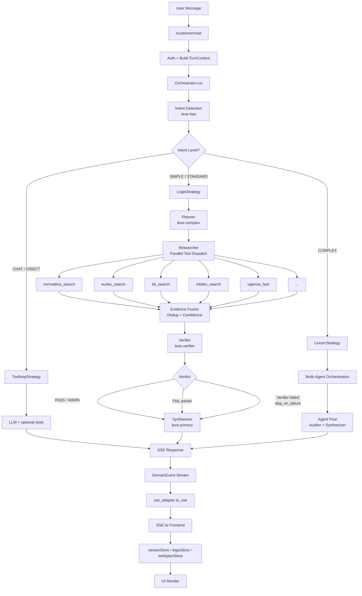
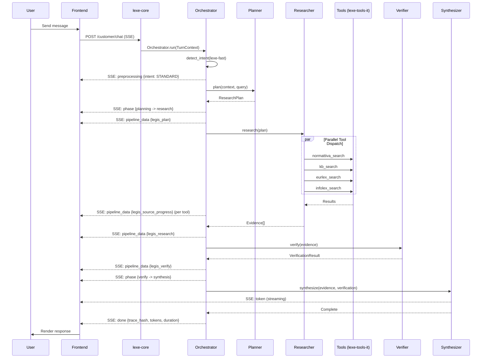

# LEXE Agentic Workflow

> Complete reference for the LEXE Legal AI agentic architecture.
> Multi-phase adaptive pipeline from user intent to synthesized legal response.

---

## 1. Overview

LEXE uses an adaptive agentic pipeline called **LEGIS** (Legal Grounded Intelligence System) to handle legal queries. The pipeline follows five phases:

```
Intent Detection > Planning > Research > Verification > Synthesis
```

Each phase is executed by a specialized agent with a dedicated LLM model alias, allowing fine-grained control over reasoning effort, token budgets, and latency. The pipeline adapts its depth based on the detected intent complexity -- a simple greeting skips directly to response, while a complex multi-norm question triggers the full research cycle.

### Key Principles

- **Adaptive depth**: not every query needs the full pipeline
- **Parallel research**: multiple legal sources queried concurrently
- **Evidence-based synthesis**: every claim must trace to a source
- **Graceful degradation**: per-capability fallback policies ensure partial results over total failure

---

## 2. Intent Detection

The first stage classifies the user message into one of five intent levels using the `lexe-fast` model (Gemini 3 Flash Preview, reasoning=medium, max_tokens=4096).

| Intent     | Description                              | Example                                  |
|------------|------------------------------------------|------------------------------------------|
| `CHAT`     | Greeting, chitchat, non-legal            | "Ciao, come stai?"                       |
| `DIRECT`   | Simple factual answer, no research       | "Cos'e' il GDPR?"                        |
| `SIMPLE`   | Single-norm lookup                       | "Art. 2043 codice civile"                |
| `STANDARD` | Multi-source legal analysis              | "Responsabilita' medica dopo L. 24/2017" |
| `COMPLEX`  | Cross-domain, multi-norm deep analysis   | "Confronto tutele privacy IT vs EU"      |

Each intent also carries a **scenario** tag (e.g., `normativa_lookup`, `giurisprudenza`, `comparazione`, `consulenza`) that influences planner behavior and tool selection.

**Key file:** `lexe-core/src/lexe_core/agent/intent_detector.py`

---

## 3. Intent Decomposer (Strategy Routing)

The decomposer maps each intent to an execution strategy:

| Intent            | Strategy       | Description                                        |
|-------------------|----------------|----------------------------------------------------|
| `CHAT`            | `toolloop`     | Direct LLM response, optional tool calls           |
| `DIRECT`          | `toolloop`     | Single-turn with possible KB lookup                |
| `SIMPLE`          | `legis`        | Abbreviated LEGIS (may skip verification)          |
| `STANDARD`        | `legis`        | Full LEGIS pipeline                                |
| `COMPLEX`         | `lexorc`       | Multi-agent orchestration (LEXORC)                 |

The decomposer also considers feature flags (`ff_legis_agent`, `ff_lexorc_enabled`) and falls back gracefully when a strategy is disabled.

**Key file:** `lexe-core/src/lexe_core/orchestration/decomposer.py`

---

## 4. Multi-Phase Research Pipeline (LEGIS)

The LEGIS pipeline is the core of LEXE's legal analysis capability. It runs four sequential phases, each with its own agent, model, and degradation policy.

### 4.1 Planner

| Property         | Value                                              |
|------------------|----------------------------------------------------|
| **Model**        | `lexe-complex` (Gemini 3 Flash, reasoning=medium)  |
| **Max tokens**   | 16,384                                             |
| **Timeout**      | 15s                                                |
| **Fallback**     | `direct_plan` (heuristic, no LLM)                  |
| **Max retries**  | 1                                                  |

The planner receives the user query + conversation context and produces a `ResearchPlan` containing:

- `sources_to_query`: list of tools to invoke (e.g., normattiva_search, eurlex_search)
- `key_norms`: specific norms to look up (e.g., "Art. 2043 c.c.", "D.Lgs. 196/2003")
- `legal_domain`: classification (civile, penale, amministrativo, europeo, ...)
- `research_questions`: decomposed sub-questions for the researcher

**Key files:**
- `lexe-core/src/lexe_core/agent/planner.py`
- `lexe-core/src/lexe_core/prompts/v1/legis_planner.py`

### 4.2 Researcher

| Property          | Value                                             |
|-------------------|---------------------------------------------------|
| **Dispatch**      | Parallel via `CapabilityDispatcher`               |
| **Timeout**       | 30s                                               |
| **Max retries**   | 2                                                 |
| **Circuit breaker**| 5 failures before open                           |

The researcher executes the plan by dispatching tool calls in parallel. Available tools:

| Tool                    | Source          | Description                              |
|-------------------------|-----------------|------------------------------------------|
| `normattiva_search`     | Normattiva      | Italian legislation full-text search     |
| `normattiva_article`    | Normattiva      | Fetch specific article by URN            |
| `eurlex_search`         | EUR-Lex         | EU legislation and case law              |
| `kb_search`             | Internal KB     | Semantic search over legal knowledge base|
| `kb_normativa_search`   | Internal KB     | Structured normativa query               |
| `infolex_search`        | InfoLex         | Legal encyclopedia and commentary        |
| `lex_search`            | Lex.do          | Legal database search                    |
| `vigenza_fast`          | Normattiva      | Quick check if a norm is still in force  |

Results are aggregated into an evidence pool with source attribution, confidence scores, and URN references.

**Key files:**
- `lexe-core/src/lexe_core/agent/researcher.py`
- `lexe-core/src/lexe_core/prompts/v1/legis_researcher.py`
- `lexe-tools-it/` (14 capabilities, 8 tools, dispatcher pattern)

### 4.3 Verifier

| Property          | Value                                               |
|-------------------|-----------------------------------------------------|
| **Model**         | `lexe-verifier` (Gemini 3 Flash, reasoning=low)     |
| **Max tokens**    | 8,192                                               |
| **Timeout**       | 10s                                                 |
| **Skip on failure** | `true` (synthesis proceeds without verification)  |

The verifier performs a 3-level check on the research results:

1. **Deterministic checks**: URN format validation, date consistency, duplicate detection
2. **LLM coherence check**: cross-reference norms against each other, flag contradictions
3. **Self-correction**: if issues found, annotate evidence with warnings or corrections

Output is a verdict per evidence item: `PASS`, `WARN`, or `FAIL`, plus an overall confidence score.

**Key files:**
- `lexe-core/src/lexe_core/agent/verifier.py`
- `lexe-core/src/lexe_core/prompts/v1/legis_verifier.py`

### 4.4 Synthesizer

| Property         | Value                                              |
|------------------|----------------------------------------------------|
| **Model**        | `lexe-primary` (Gemini 3 Flash, reasoning=medium)  |
| **Max tokens**   | 16,384                                             |
| **Timeout**      | 60s                                                |
| **Max retries**  | 1                                                  |

The synthesizer produces the final response using a 7-section format:

1. **Riepilogo** -- executive summary of the legal question and answer
2. **Quadro normativo** -- relevant legislation with article references and Normattiva links
3. **Giurisprudenza** -- relevant case law (Cassazione, Corte Costituzionale, CGUE)
4. **Contraddizioni e criticita'** -- conflicting norms, open interpretive questions
5. **Cronologia** -- temporal evolution of the relevant legislation
6. **Livello di confidenza** -- overall confidence with explanation
7. **Approfondimenti suggeriti** -- follow-up questions for deeper analysis

The synthesizer selects from 7 prompt scenarios based on the intent scenario tag (e.g., `normativa_lookup` uses a norm-focused template, `comparazione` uses a comparative template).

**Key files:**
- `lexe-core/src/lexe_core/agent/synthesizer.py`
- `lexe-core/src/lexe_core/prompts/v1/legis_synthesizer.py`

---

## 5. Tool Diversity Enforcement

To avoid single-source bias, the researcher enforces tool diversity. If the planner's `sources_to_query` list is too narrow (e.g., only `normattiva_search`), the researcher automatically injects missing mandatory sources:

- `normattiva_search` or `normattiva_article` (always for Italian law questions)
- `kb_search` or `kb_normativa_search` (always for structured lookups)
- `infolex_search` (when doctrinal context is relevant)

This ensures the evidence pool draws from multiple independent sources, improving cross-validation in the verification phase.

---

## 6. Evidence Fusion

After research completes, results from all tools are fused into a unified evidence pool:

- **URN deduplication**: identical norms found via different tools are merged
- **RV (Riferimento Vigenza) dedup**: vigenza checks are consolidated
- **Confidence boost**: evidence found independently by multiple sources gets a confidence boost
- **Confidence penalty**: evidence contradicted by another source gets a penalty
- **Source attribution**: every piece of evidence retains its source chain for traceability

---

## 7. Verification Details

The verifier performs these specific checks:

| Check                  | Type           | Description                                    |
|------------------------|----------------|------------------------------------------------|
| URN format             | Deterministic  | Validates URN syntax against NormInForce spec  |
| Date consistency       | Deterministic  | Checks that cited dates match the norm's dates |
| Duplicate detection    | Deterministic  | Flags duplicate citations                      |
| Vigenza cross-check    | Deterministic  | Confirms norm is still in force via vigenza_fast|
| Norm coherence         | LLM            | Checks cited norms actually support the claim  |
| Cross-source agreement | LLM            | Flags contradictions between sources           |
| Self-correction        | LLM            | Proposes fixes for WARN/FAIL items             |

Verdicts:
- **PASS**: evidence is verified and consistent
- **WARN**: minor issues (e.g., norm superseded but still relevant historically)
- **FAIL**: evidence is incorrect or contradicted (excluded from synthesis)

---

## 8. Synthesis Format

The synthesizer uses 7 prompt scenarios, selected based on the intent's scenario tag:

| Scenario              | Focus                                   | Sections emphasized           |
|-----------------------|-----------------------------------------|-------------------------------|
| `normativa_lookup`    | Specific norm analysis                  | Quadro normativo, Cronologia  |
| `giurisprudenza`      | Case law research                       | Giurisprudenza, Contraddizioni|
| `comparazione`        | Cross-jurisdiction comparison           | All sections, comparative     |
| `consulenza`          | Practical legal advice                  | Riepilogo, Approfondimenti    |
| `procedura`           | Procedural guidance                     | Quadro normativo, step-by-step|
| `interpretazione`     | Doctrinal interpretation                | Contraddizioni, Giurisprudenza|
| `default`             | General legal question                  | All sections balanced         |

All responses include:
- Inline Normattiva links for Italian legislation (deep-linked to specific articles)
- Confidence level with explanation
- Deepening suggestions phrased as questions from the user's perspective

---

## 9. Feature Flags

| Flag                       | Default | Description                                          |
|----------------------------|---------|------------------------------------------------------|
| `ff_legis_agent`           | `true`  | Enable LEGIS pipeline for STANDARD intents           |
| `ff_orchestration_v2`      | `true`  | Use Orchestration v2 3-layer architecture (Phase 3+) |
| `ff_lexorc_enabled`        | `false` | Enable LEXORC multi-agent for COMPLEX intents        |
| `ff_multi_agent_research`  | `false` | Enable parallel multi-agent research dispatching     |

When `ff_legis_agent` is disabled, STANDARD intents fall back to the `toolloop` strategy (direct LLM with tool calls, no structured pipeline).

---

## 10. Orchestration v2 Architecture

Orchestration v2 introduces a clean 3-layer separation of concerns.

### 10.1 Layer Diagram

```
+----------------------------------------------------------+
|                    ORCHESTRATION LAYER                     |
|  contracts.py   events.py   strategy.py   orchestrator.py |
|  decomposer.py                                            |
+---------------------------+------------------------------+
                            |
                     DomainEvents
                            |
+---------------------------v------------------------------+
|                      GATEWAY LAYER                        |
|  adapters.py (ToolKit, LLMClient, PipelineRunner)        |
|  sse_adapter.py (DomainEvent -> SSE)                     |
|  sse_contracts.py                                        |
+---------------------------+------------------------------+
                            |
                   Tool/LLM/Pipeline calls
                            |
+---------------------------v------------------------------+
|                       AGENT LAYER                         |
|  intent_detector.py   planner.py   researcher.py         |
|  verifier.py   synthesizer.py   models.py   events.py   |
+----------------------------------------------------------+
```

### 10.2 TurnContext

The `TurnContext` dataclass is the central state container passed through every phase:

```python
@dataclass
class TurnContext:
    conversation_id: str
    tenant_id: str
    user_message: str
    history: list[dict]
    intent: Intent | None
    plan: ResearchPlan | None
    evidence: list[Evidence]
    verification: VerificationResult | None
    tool_kit: ToolKit          # Protocol for tool dispatch
    llm_client: LLMClient      # Protocol for LLM calls
    pipeline_runner: PipelineRunner | None  # Protocol for pipeline execution
    budget: BudgetHandle        # Token/time budget tracking
    metadata: dict
```

### 10.3 DomainEvent Hierarchy

All pipeline communication uses a typed event hierarchy (17 event types):

| Event Type           | Description                                   |
|----------------------|-----------------------------------------------|
| `MetaEvent`          | Conversation/turn metadata                    |
| `PhaseEvent`         | Pipeline phase transition                     |
| `PreprocessingEvent` | Input preprocessing results                   |
| `TokenEvent`         | Streaming LLM tokens                          |
| `ToolCallEvent`      | Tool invocation started                       |
| `ToolResultEvent`    | Tool returned results (enriched with metadata)|
| `ToolEndEvent`       | Tool execution completed                      |
| `ToolRunStartEvent`  | Multi-tool run batch started                  |
| `ToolRunEndEvent`    | Multi-tool run batch completed                |
| `ErrorEvent`         | Error with recovery info                      |
| `DoneEvent`          | Turn completed with trace hash                |
| `PipelineDataEvent`  | Generic carrier for pipeline-specific data    |
| `IntentEvent`        | Intent detection result                       |
| `PlanEvent`          | Research plan generated                       |
| `ResearchEvent`      | Research results collected                    |
| `VerifyEvent`        | Verification results                          |
| `SourceProgressEvent`| Real-time source query progress               |

### 10.4 Strategy Pattern

Each strategy implements the `Strategy` protocol:

```python
class Strategy(Protocol):
    async def execute(self, ctx: TurnContext) -> AsyncGenerator[DomainEvent, None]:
        ...
```

Available strategies:

| Strategy          | File                              | Use case              |
|-------------------|-----------------------------------|-----------------------|
| `ToolloopStrategy`| `strategies/toolloop.py`          | CHAT, DIRECT intents  |
| `LegisStrategy`   | `strategies/legis.py`             | SIMPLE, STANDARD      |
| `SuperToolStrategy`| `strategies/super_tool.py`       | Experimental          |
| `LexorcStrategy`  | `strategies/lexorc.py`            | COMPLEX intents       |

### 10.5 Degradation Policy

Each strategy defines per-capability degradation policies via `DegradationPolicy`:

```python
@dataclass
class CapabilityDegradation:
    fallback: str | None        # Fallback strategy name
    max_retries: int            # Max retry attempts
    timeout_ms: int             # Timeout in milliseconds
    circuit_breaker: int | None # Failures before circuit opens
    skip_on_failure: bool       # Continue pipeline if this fails
```

**LEGIS degradation policy:**

| Capability    | Fallback       | Retries | Timeout | Circuit Breaker | Skip on Failure |
|---------------|----------------|---------|---------|-----------------|-----------------|
| `planner`     | `direct_plan`  | 1       | 15s     | --              | no              |
| `researcher`  | --             | 2       | 30s     | 5               | no              |
| `verifier`    | --             | 0       | 10s     | --              | yes             |
| `synthesizer` | --             | 1       | 60s     | --              | no              |

The verifier's `skip_on_failure=true` is critical: if verification fails or times out, the pipeline continues to synthesis with unverified evidence rather than failing the entire request.

### 10.6 Gateway Adapters

The gateway layer provides protocol adapters that decouple the orchestration from concrete implementations:

| Adapter               | Protocol          | Wraps                                      |
|-----------------------|-------------------|--------------------------------------------|
| `ToolKitAdapter`      | `ToolKit`         | lexe-tools-it capabilities                 |
| `HttpLLMClient`       | `LLMClient`       | LiteLLM HTTP API                           |
| `PipelineRunnerAdapter`| `PipelineRunner` | legis/super_tool/lexorc pipeline execution |

The `PipelineRunnerAdapter` includes a universal SSE parser (`_parse_sse_to_event()`) that converts raw SSE from pipeline processes into typed `DomainEvent` instances.

### 10.7 Architecture Enforcement

The boundary between orchestration and gateway is enforced by `tests/test_architecture.py`, which ensures:
- Orchestration layer never imports from gateway directly
- Agent layer never imports from orchestration
- All cross-layer communication uses protocols defined in `contracts.py`

---

## 11. SSE Events

The frontend receives Server-Sent Events throughout the pipeline execution.

### 11.1 Core SSE Events

| SSE Event           | Payload                                      | When                        |
|---------------------|----------------------------------------------|-----------------------------|
| `meta`              | `{conversation_id, model, trace_hash}`       | Turn start                  |
| `phase`             | `{phase: "planning"|"research"|...}`         | Phase transition            |
| `preprocessing`     | `{intent, scenario, language}`               | After intent detection      |
| `token`             | `{content: "..."}`                           | Each LLM token              |
| `tool_call`         | `{tool, arguments}`                          | Tool invocation             |
| `tool_result`       | `{tool, result, duration_ms}`                | Tool response               |
| `tool_end`          | `{}`                                         | Tool execution done         |
| `tool_run_start`    | `{run_id, tools: [...]}`                     | Batch tool dispatch         |
| `tool_run_end`      | `{run_id, results_count}`                    | Batch complete              |
| `error`             | `{message, recoverable}`                     | Error occurred              |
| `done`              | `{trace_hash, tokens_used, duration_ms}`     | Turn complete               |
| `pipeline_data`     | `{type: "...", data: {...}}`                 | Generic pipeline carrier    |

### 11.2 Pipeline-Specific SSE Events

These are sent as `pipeline_data` events with specific `type` values:

| Type                    | Data                                         | Pipeline  |
|-------------------------|----------------------------------------------|-----------|
| `legis_intent`          | `{intent, scenario, confidence}`             | LEGIS     |
| `legis_plan`            | `{sources, key_norms, domain}`               | LEGIS     |
| `legis_research`        | `{sources_queried, results_count}`           | LEGIS     |
| `legis_verify`          | `{pass_count, warn_count, fail_count}`       | LEGIS     |
| `legis_source_progress` | `{source, status, results}`                  | LEGIS     |
| `lexorc_phase`          | `{phase, description}`                       | LEXORC    |
| `lexorc_chessboard`     | `{agents, status}`                           | LEXORC    |
| `lexorc_plan_node`      | `{node_id, task, status}`                    | LEXORC    |

### 11.3 Frontend Stores

The frontend processes SSE events through dedicated stores:

| Store            | Handles                                      | UI Component              |
|------------------|----------------------------------------------|---------------------------|
| `streamStore`    | `token`, `meta`, `done`                      | Chat message streaming    |
| `legisStore`     | `legis_*` events                             | LEGIS pipeline progress   |
| `workplanStore`  | `lexorc_*` events                            | LEXORC workplan display   |

---

## 12. End-to-End Flow Diagram



### Sequence (STANDARD intent, full LEGIS)



---

## Appendix: Model Assignments (Sprint 9)

All primary model aliases point to **Gemini 3 Flash Preview** as of Sprint 9 (2026-03-12).

| Alias           | Role                  | Reasoning Effort | Max Tokens | Use in Pipeline       |
|-----------------|-----------------------|------------------|------------|-----------------------|
| `lexe-fast`     | Intent detection      | medium           | 4,096      | Intent detector       |
| `lexe-primary`  | Synthesis             | medium           | 16,384     | Synthesizer           |
| `lexe-complex`  | Planning              | medium           | 16,384     | Planner               |
| `lexe-verifier` | Verification          | low              | 8,192      | Verifier              |
| `lexe-frontier` | Max quality writing   | high             | 16,384     | LEXORC, premium tasks |
| `lexe-embedding`| Vector embeddings     | --               | --         | KB search, memory     |

Support models (not part of core pipeline): `gpt-5-mini`, `qwen3.5-plus`, `deepseek-v3.2`, `gem-flash-reason-med`.

---

## Appendix: Key File Paths

| Layer          | Path                                                         | Contents                           |
|----------------|--------------------------------------------------------------|------------------------------------|
| Orchestration  | `lexe-core/src/lexe_core/orchestration/contracts.py`         | TurnContext, protocols             |
| Orchestration  | `lexe-core/src/lexe_core/orchestration/events.py`            | DomainEvent hierarchy              |
| Orchestration  | `lexe-core/src/lexe_core/orchestration/orchestrator.py`      | Main orchestration loop            |
| Orchestration  | `lexe-core/src/lexe_core/orchestration/decomposer.py`        | Intent-to-strategy routing         |
| Orchestration  | `lexe-core/src/lexe_core/orchestration/strategy.py`          | Base strategy + degradation        |
| Strategies     | `lexe-core/src/lexe_core/orchestration/strategies/legis.py`  | LEGIS pipeline strategy            |
| Strategies     | `lexe-core/src/lexe_core/orchestration/strategies/toolloop.py`| Tool loop strategy                |
| Strategies     | `lexe-core/src/lexe_core/orchestration/strategies/lexorc.py` | LEXORC multi-agent strategy        |
| Gateway        | `lexe-core/src/lexe_core/gateway/adapters.py`                | ToolKit, LLMClient, PipelineRunner |
| Gateway        | `lexe-core/src/lexe_core/gateway/sse_adapter.py`             | DomainEvent to SSE translation     |
| Agent          | `lexe-core/src/lexe_core/agent/intent_detector.py`           | Intent classification              |
| Agent          | `lexe-core/src/lexe_core/agent/planner.py`                   | Research plan generation           |
| Agent          | `lexe-core/src/lexe_core/agent/researcher.py`                | Parallel tool dispatch             |
| Agent          | `lexe-core/src/lexe_core/agent/verifier.py`                  | 3-level verification               |
| Agent          | `lexe-core/src/lexe_core/agent/synthesizer.py`               | 7-section response synthesis       |
| Prompts        | `lexe-core/src/lexe_core/prompts/v1/legis_*.py`             | All LEGIS prompt templates         |
| Tools          | `lexe-tools-it/`                                             | 14 capabilities, 8 tools           |
| Tests          | `lexe-core/tests/test_architecture.py`                       | Layer boundary enforcement         |

---

*Last updated: 2026-03-13*
